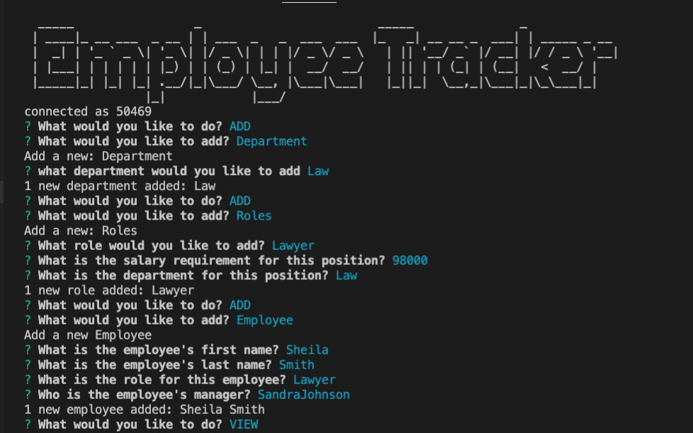
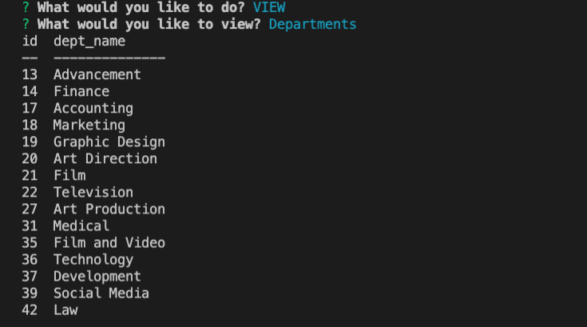
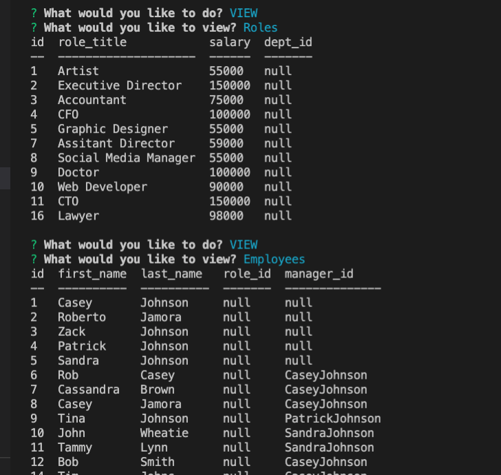
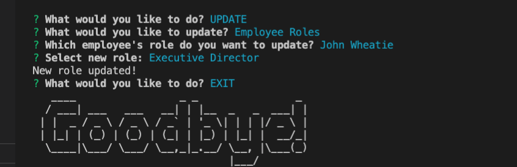

# HW12-Employee-Tracker

## Table of Contents
[Technologies Used](#Technologies-Used) 
[Installation](#Installation) 
[User Story](#User-Story) 
[Images](#Images) 
[Demo](#Demo) 
[Contact](#Contact) 

## Technologies Used
        Javascript
        Node.js
        Inquirer
        Figlet
        MySQL
        console.table
        
## Installation

    To install dependencies: Run npm i
    To run Employee Tracker: Run node employeeTracker

## User Story    
    As a business owner
    I want to be able to view and manage the departments, roles, and employees in my company
    So that I can organize and plan my business

## Images

## Demo

[Link to Video Demo](https://drive.google.com/file/d/15976vj4IJapbtcXPFfA3ZiNr0ZZ_vGFV/view)

## Contact

Please contact me at johnsoncm3@gmail.com or visit [johnsoncm](https://www.github.com/johnsoncm) for any questions or comments.
